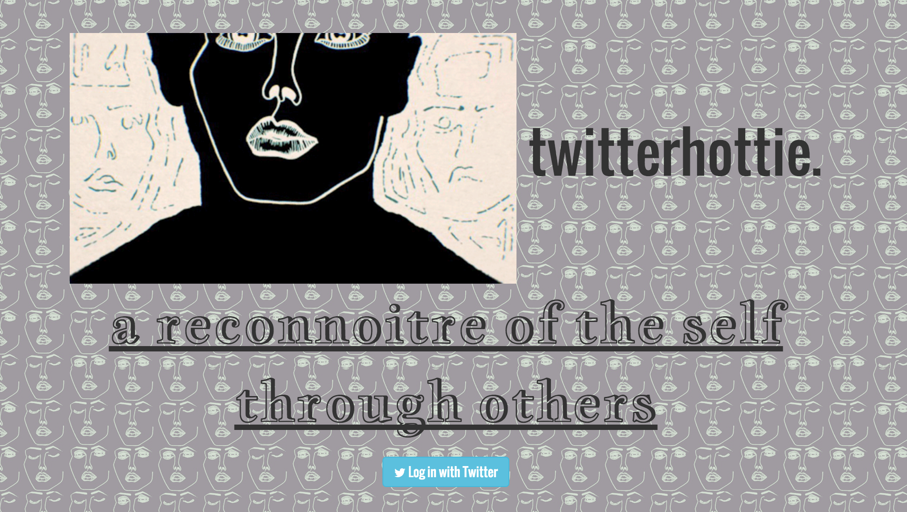
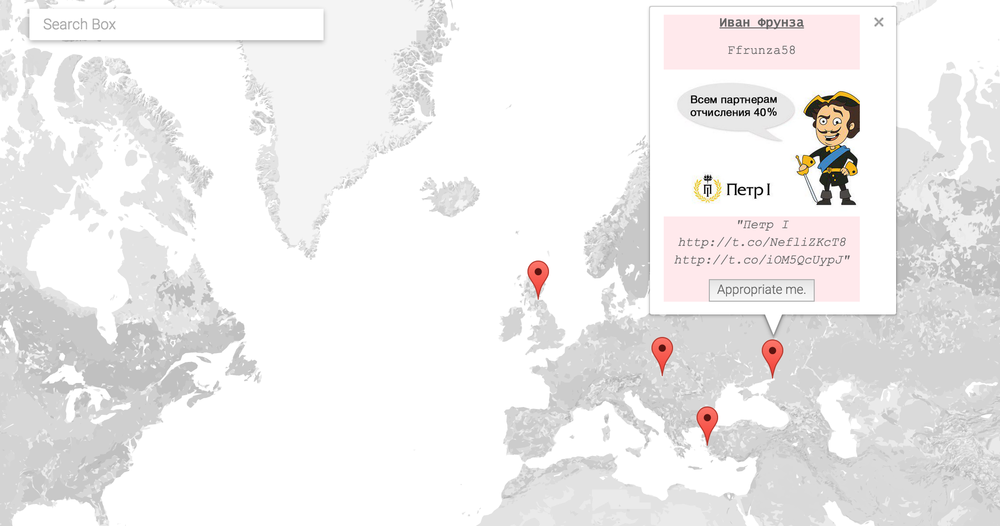
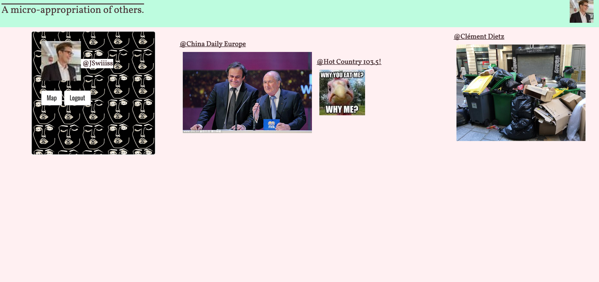

# TWITTERHOTTIE READ ME

## A Reconnoitre of the Self Through Other

Twitterhottie (pr: “twitter – ’ah – tea”) is a place to explore and curate the 
selfportraits (or “selfies”) of Twitter users who post their portraits in close 
geographic proximity to our users. The transient and hyper-ephemeral nature of 
Twitter poses a challenge to those who wish to preserve, organise and re-visit their favourite selfies. In allowing users to organise and tag the selfies of others, our site becomes a curation of the curated. In other words, this meta-curation allows us to explore the nature of identity through the eyes of the collective.

Our site will allow users to find, save and tag their favourite selfies on a map of
their local area. Over time, users will create a database of the self-portraits of
others. In doing so, Twitterhottie de-centres the subject of the “selfie” towards
the observer. In this era of performative identity creation, we posit that such a
role reversal will empower our users to transform their own identities through
the systematic micro-appropriation of the other. 

Run locally with the terminal command `npm start`. Then access the site at [http://127.0.0.1:3000] (http://127.0.0.1:3000)

The user's journey through Twitterhottie begins by logging in through their Twitter account.

Upon logging in, the user is shown a map where all tweets with media are displayed according to their geographic location in real time. The user can view the images attached to these tweets and appropriate those images as s/he feels fit.

The images selected by the user are stored in their profile page. Here the user can peruse the visual zeitgeist that has tickled their fancy during the snapshot in time whence they were selected.

##Future Improvements and Additions
Twitterhottie will always be a work in progress, as it is little more than a display of the now. Currently the user can curate, but not interact. Future iterations will allow the user to edit and delete their collection of images, as well as interact with the Twitter users who have created said content.

Additional improvements in performance and refactoring are needed as well. Mustachejs will be used to clean up some of the JS that contains HTML.

##Technology in Use
For authentication we used Passport's Twitter Authentication.

We used Google Maps Places Search API for the map.

Twitter's Streaming API provided the tweets.

We used a combination of vanilla Javascript and JQuery, and pulled it all together with Nodejs.

In addition, we used the following modules and frameworks:

- Bootstrapjs
- NormalizeCSS
- Express
- Mongoose
- MongoDB
- Morgan
- Body Parser
- Cookie Parser
- Socket.io
- Express Layouts
- Express Session
- Flash
- EJS
- Geocoder
- Twit

##CSS and Styling
As our theme of “curation”, we sought inspiration for our styling from sources such as Dazed&Confused and AnOther to give the profile page the look and feel of an independent culture magazine.  Our palate was pastels, including dusted pinks and aquamarines, so that the focus could be on the images.  On the map page, we added only a minimal amount of styling to the popup markers for this reason – we did not want to distract the user.  However, on the login page, we decided to display more vibrant moving images of facial outlines to give the user a impression of the underlying buzz of Twitter.  This was also done as the movement does not detract from any core content on the login page.

